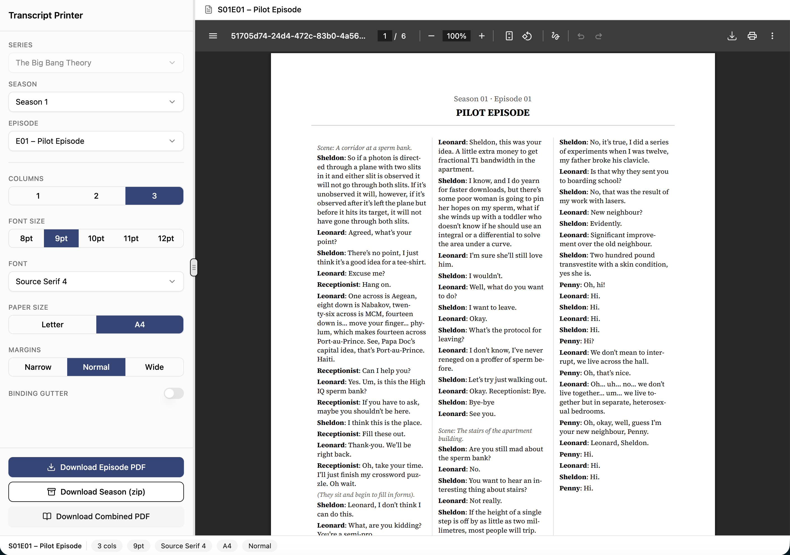

# transcript-formatter

A React + TypeScript app for previewing and exporting TV episode transcripts as print-friendly PDFs.

Right now, the included dataset targets(S01 - S10) **The Big Bang Theory (TBBT)** and supports:

- episode-level PDF preview in the browser
- episode PDF download
- season ZIP download (one PDF per episode)
- combined season PDF download (single file with cover + contents)

## UI preview

## Why this project exists

The idea just came to me when watching TBBT once more for meals. The dialogue is really fun but honestly too quick to fully understand as a non-native speaker. 

I'd love to print them out and read at my own pace while taking notes, and it is even better if the layout can be clean and configurable, as some dialogues are dense and some are sparse, which may consume more or less space on paper.

Then I built this! In case you have the same needs, feel free to use it. It is open source and I am happy to receive contributions.

## Quick start

### Prerequisites

- Node.js (current LTS recommended)
- npm

### Run locally

1. Install dependencies:
   - `npm install`
2. Start the dev server:
   - `npm run dev`
3. Open the local URL shown by Vite (usually `http://localhost:5173`)

That’s it — you can immediately select episodes and generate PDFs.

## How to use

1. Choose **Season** and **Episode** in the left control panel.
2. Tune print settings:
   - columns (1–3)
   - font size and family
   - paper size (Letter/A4)
   - margins (narrow/normal/wide)
   - optional binding gutter (with optional mirrored margins)
3. Preview updates in the right pane.
4. Export:
   - **Download Episode PDF**
   - **Download Season (zip)**
   - **Download Combined PDF**

## Data model and file layout

Transcript data lives in:

- `public/data/tbbt/index.json`
- `public/data/tbbt/S{SS}/s{SS}e{EE}.json`

Examples:

- `public/data/tbbt/S01/s01e01.json`
- `public/data/tbbt/S10/s10e24.json`

`index.json` is the source of truth. The app loads episodes by following `episodes[].file` paths from the index.

### `index.json` shape

- `series`
- `seasons[]`
  - `season`
  - `episodes[]`
		- `episode`
		- `title`
		- `file`

### episode JSON shape

- `series`
- `season`
- `episode`
- `title`
- `url`
- `lines[]`
  - `type`: `scene | dialog | direction`
  - `text`
  - optional `character`
  - optional `direction`

## Scripts

### App scripts

- `npm run dev` — start Vite dev server
- `npm run build` — TypeScript project build + Vite production build
- `npm run preview` — preview production build
- `npm run lint` — run ESLint

### Data scripts

- `npm run scrape:index` — scrape and regenerate `public/data/tbbt/index.json`
- `npm run scrape:episode` — scrape episode transcript files (supports flags)
- `npm run validate` — validate index paths, file existence, and transcript sanity

### Common data workflow

1. Regenerate index:
   - `npm run scrape:index`
2. Scrape episodes (example: season 1):
   - `npm run scrape:episode -- --season=1`
3. Validate generated data:
   - `npm run validate`
4. Run app and verify output:
   - `npm run dev`

Optional targeted scrape example:

- `npm run scrape:episode -- --season=2 --episode=5`

## Architecture overview

### Frontend runtime flow

1. `src/App.tsx` coordinates selected season/episode, settings, preview, and export actions.
2. `src/hooks/useTranscript.ts` fetches:
   - `/data/tbbt/index.json`
   - selected `/data/tbbt/{fileFromIndex}`
3. `src/components/ui/ControlPanel.tsx` controls settings + download actions.
4. `src/components/ui/PDFPreview.tsx` renders live preview via `@react-pdf/renderer`.
5. `src/components/pdf/PDFDocument.tsx` and `CombinedSeasonPDF.tsx` compose printable documents.

### Layout/pagination internals

- `src/utils/pageChunker.ts` estimates line heights and chunks transcript lines into pages.
- `src/utils/lineHeightEstimator.ts` computes text height heuristics by line type/font/column width.
- `src/utils/columnSplitter.ts` balances lines across columns.
- `src/utils/layoutConstants.ts` centralizes paper sizes, margins, spacing constants.
- `src/utils/fontLoader.ts` registers embedded fonts from `public/fonts`.

### Data pipeline internals

- `scripts/scrape-tbbt.ts` scrapes index + episodes from the source site.
- `scripts/parse-utils.ts` classifies paragraphs into transcript line types.
- `scripts/validate.ts` enforces file/path and basic content sanity checks.

## Project structure

- `src/` — app source
  - `components/pdf/` — PDF composition components
  - `components/ui/` — app controls + shell UI
  - `hooks/` — transcript fetch + settings state hooks
  - `utils/` — layout and pagination logic
  - `types/` — shared TypeScript models
- `scripts/` — scraping and validation scripts
- `public/data/tbbt/` — transcript dataset
- `public/fonts/` — PDF font assets

## Troubleshooting

- **Nothing loads / fetch errors**
  - Ensure `public/data/tbbt/index.json` exists and episode file paths are valid.
  - Run `npm run validate` to detect missing or malformed data.

- **PDF layout looks off after changing settings**
  - Wait a moment for debounced preview updates.
  - Try reducing columns or font size for dense episodes.

- **Season export is slow**
  - Combined/ZIP exports render multiple PDFs in sequence; this is expected for large seasons.

- **Build issues**
  - Confirm dependencies are installed (`npm install`) and rerun `npm run build`.

## Current scope and limitations

- The bundled UI is currently wired for a single series dataset (`tbbt`).
- Data scraping depends on the source website structure; scraper updates may be needed if markup changes.

## Acknowledgments

- Transcript source data used by this project is scraped from **big bang theory transcripts**:
   - https://bigbangtrans.wordpress.com/
- Huge thanks to **Ash** (site maintainer/transcriber) for the time and effort behind that archive.
- Credit for episode dialogue and scripts belongs to the original creators and rights holders of *The Big Bang Theory*.

If you reuse or redistribute generated transcript-derived content, please keep attribution to the source archive and respect applicable copyright and fair-use rules in your jurisdiction.

## License

See `LICENSE`.